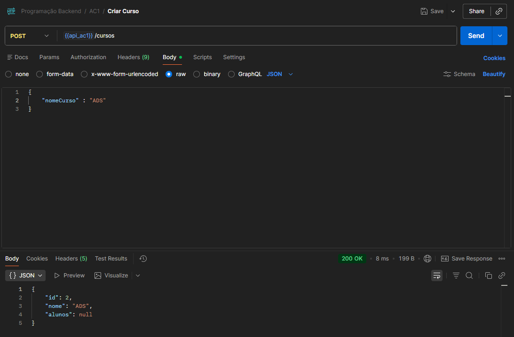
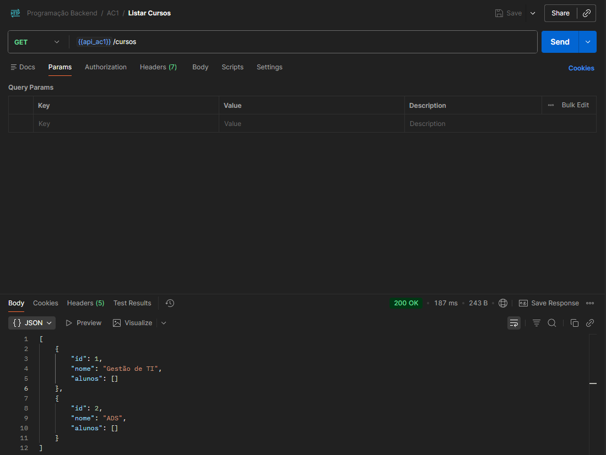
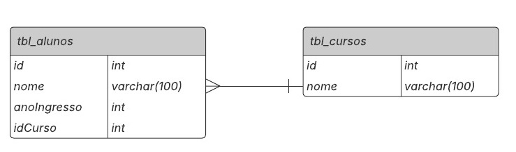

# FACENS - Backend AC1

## 📸 Evidências das Requisições HTTP

Inserção de curso via requisição HTTP

Listagem de todos os cursos cadastrados

> As requisições foram realizadas utilizando o cliente HTTP **Postman**.

---

## 📚 Descrição da Avaliação

Este projeto foi desenvolvido como parte da **Parte 1 da Avaliação Continuada** da disciplina de **Desenvolvimento Back-End** do curso de **Análise e Desenvolvimento de Sistemas** do **Centro Universitário Facens**.

O objetivo da atividade é implementar uma API utilizando **Spring Boot** e **JPA**, aplicando conceitos de persistência de dados, relacionamentos entre entidades e criação de repositórios e controladores.

---

## 👨‍🎓 Informações do Aluno

- **Aluno:** Kauê Felippe Tiburcio
- **RA:** 247721
- **Disciplina:** AS503TSN1 - Desenvolvimento Web Back-End
- **Instituição:** Centro Universitário Facens

---

## 🗂 Modelagem do Banco de Dados

A estrutura do banco de dados segue o **Diagrama Entidade-Relacionamento (ER)**, contendo as entidades:

- **Curso**
- **Aluno**

Com relacionamento entre as duas entidades.

---

## ⚙️ Requisitos da Implementação

### 1️⃣ Entidades JPA

Implementar as seguintes entidades utilizando **JPA**:

- **Curso**
    - Nome da tabela no banco: `tbl_cursos`

- **Aluno**
    - Nome da tabela no banco: `tbl_alunos`

---

### 2️⃣ Relacionamento entre Entidades

Criar o relacionamento entre **Curso** e **Aluno** com:

- Navegabilidade cruzada entre as entidades
- Mapeamento correto utilizando anotações JPA

---

### 3️⃣ Repositórios

Criar as classes de repositório com os seguintes métodos:

#### 📦 AlunoRepository
Métodos obrigatórios:

- Inserir
- Editar
- Excluir
- Selecionar todos
- Selecionar por ID

#### 📦 CursoRepository
Métodos obrigatórios:

- Inserir
- Editar
- Excluir
- Selecionar todos
- Selecionar por ID

---

### 4️⃣ Controller

Criar a classe **CursoController** contendo os métodos:

- Inserir curso
- Mostrar todos os cursos

---

### 5️⃣ Teste via Console

Implementar um teste em console que:

- Insira **2 cursos**
- Insira **2 alunos**
- Exiba **todos os cursos**
- Exiba **todos os alunos**

---

### 6️⃣ Teste via HTTP

Utilizando **Thunder Client** (ou Postman):

- Criar uma requisição HTTP para **inserir um curso**
- Criar uma requisição HTTP para **listar todos os cursos cadastrados**

---

## 🛠 Tecnologias Utilizadas

- Java
- Spring Boot
- Spring Data JPA
- Lombok
- Maven
- Banco de dados H2 (em memória)
- Postman
- Git e GitHub
